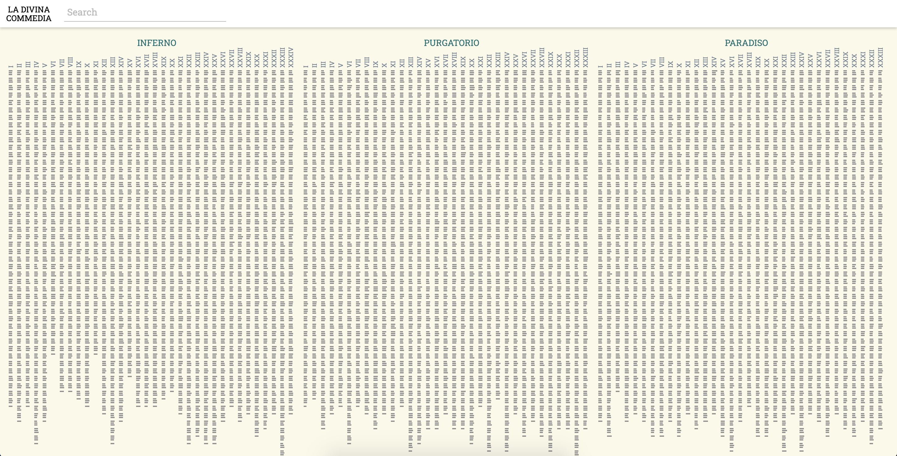
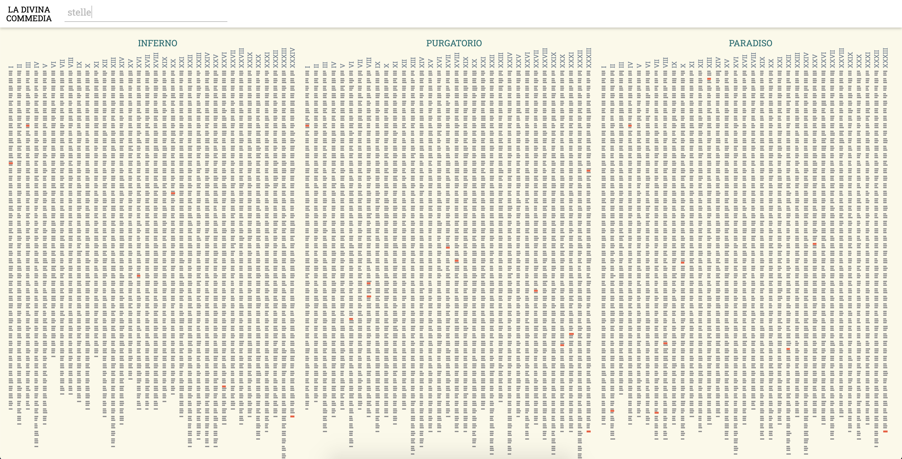
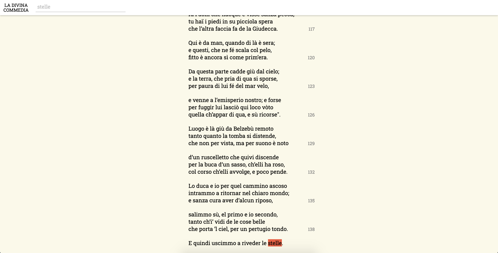

# Divina Commedia Visualization




The well-known [Divina Commedia](https://en.wikipedia.org/wiki/Divine_Comedy) wrote by Dante Alighieri is one of the greatest works of world literature and characterized by a very peculiar structure. It is composed by three parts: Inferno, Purgatorio and Paradiso, each of them consisting in 33 cantos (An initial canto, serving as an introduction to the poem and generally considered to be part of the first cantica, brings the total number of cantos to 100). Additionally, the verse scheme used, [terza rima](https://en.wikipedia.org/wiki/Terza_rima), is hendecasyllabic, with the lines composing [tercets](https://en.wikipedia.org/wiki/Tercet) according to the rhyme scheme aba, bcb, cdc, ded, ...

Due to the importance of the poem and its specific structure this repository provides a structured JSON file that can be used for diffent kind of processes such as text analysis or data visualization. Take a look at this [visualization demo](https://fabiovalse.github.io/Divina-Commedia-Visualization/vis/) for consulting the poem.

The original italian text of the poem has been downloaded from [Wikisource](https://it.wikisource.org/wiki/Divina_Commedia).

## Scripts
### download.py
This is the python script used for downloading the _wikitext_ of every cantos of the poem. The repository already includes the texts under the *wikisource_data* folder.

Wikitexts have been downloaded using Wikisource API returning JSON objects. An URL example is: 
`https://it.wikisource.org/w/api.php?action=query&titles=Divina_Commedia/Inferno/Canto%20I&prop=revisions&rvprop=content&format=json`

### parse.py
This python script loads each JSON file contained in the wikisource_data folder, parse and clean the wikitext it contains, and produces a structured JSON file of the entire poem: *divina_commedia.json*. It has the following structure:
```
{
  "name": "Divina Commedia",
  "author": "Dante Alighieri",
  "children": [
    {
      "type": "Volume",
      "name": "Inferno",
      "children": [
        {
          "type": "Canto",
          "name": "Canto I",
          "children": [
            {
              "type": "Terzina",
              "number": 1,
              "children": [
                {
                  "text": "Nel mezzo del cammin di nostra vita",
                  "type": "Verso",
                  "number": 1,
                  "text_length": 60
                },
                {
                  "text": "mi ritrovai per una selva oscura,",
                  "type": "Verso",
                  "number": 2,
                  "text_length": 33
                },
                {
                  "text": "ché la diritta via era smarrita. ",
                  "type": "Verso",
                  "number": 3,
                  "text_length": 40
                }
              ]
            },
            ...
          ]
        },
        ...
      ]
    },
    ...
  ]
```
